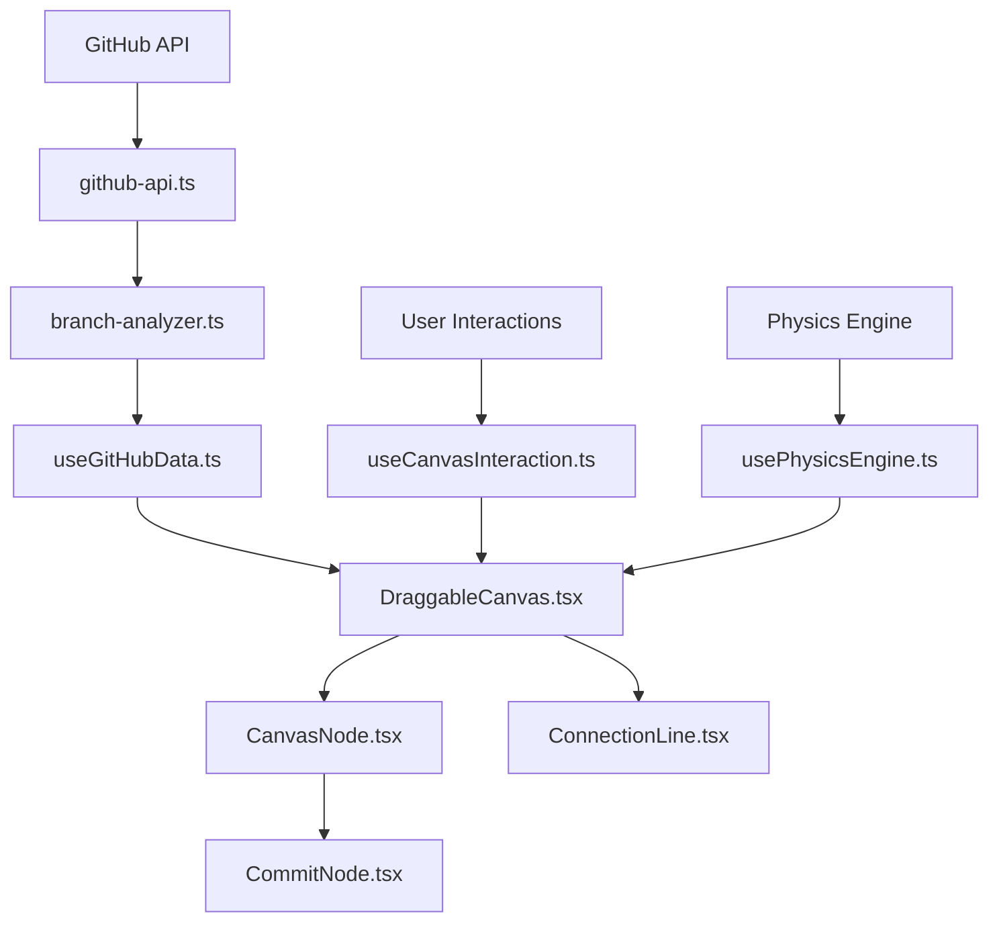

# Design Document

## Overview

This design outlines the refactoring of the monolithic DraggableCanvas.tsx component into a modular, maintainable architecture. The refactoring will separate concerns into distinct layers: types, services, hooks, utilities, and UI components. The new architecture will maintain all existing functionality while improving code organization, testability, and developer experience.

## Architecture

### High-Level Structure

```
src/components/canvas/
├── types/
│   ├── github.ts          # GitHub-related interfaces
│   ├── canvas.ts          # Canvas and positioning types
│   └── index.ts           # Re-export all types
├── services/
│   ├── github-api.ts      # GitHub API integration
│   ├── branch-analyzer.ts # Branch relationship analysis
│   └── index.ts           # Re-export all services
├── hooks/
│   ├── useCanvasInteraction.ts  # Pan, zoom, drag logic
│   ├── usePhysicsEngine.ts      # Node physics and animations
│   ├── useGitHubData.ts         # GitHub data fetching
│   └── index.ts                 # Re-export all hooks
├── utils/
│   ├── layout-calculator.ts     # Tree layout algorithms
│   ├── coordinate-transformer.ts # Screen/world coordinate conversion
│   ├── date-formatter.ts        # Date formatting utilities
│   └── index.ts                 # Re-export all utils
├── components/
│   ├── DraggableCanvas.tsx      # Main orchestrating component
│   ├── CanvasNode.tsx           # Individual node rendering
│   ├── ConnectionLine.tsx       # Connection line rendering
│   ├── CommitNode.tsx           # Commit node rendering
│   └── index.ts                 # Re-export all components
└── index.ts                     # Main export
```

## Components and Interfaces

### Type Definitions

#### github.ts
- `PullRequest` - GitHub pull request data structure
- `Issue` - GitHub issue data structure  
- `Branch` - Enhanced branch data with relationship info
- `Collaborator` - GitHub collaborator information
- `BranchConnection` - Connection between branches

#### canvas.ts
- `Position` - 2D coordinate position
- `Velocity` - 2D velocity vector
- `CanvasState` - Canvas pan/zoom state
- `NodePhysics` - Physics properties for nodes
- `DragState` - Drag operation state

### Service Layer

#### github-api.ts
Handles all GitHub API interactions with proper error handling and rate limiting:
- `fetchBranches()` - Get repository branches
- `fetchPullRequests()` - Get pull requests
- `fetchCommits()` - Get commit history
- `fetchCollaborators()` - Get repository collaborators
- `compareBranches()` - Compare two branches

#### branch-analyzer.ts
Analyzes branch relationships and builds tree structure:
- `calculateBranchTree()` - Build parent-child relationships
- `analyzeBranchStatus()` - Determine ahead/behind status
- `detectMergedBranches()` - Identify merged branches

### Hook Layer

#### useCanvasInteraction.ts
Manages canvas pan, zoom, and coordinate transformations:
- Pan state management
- Zoom level control
- Mouse/touch event handling
- Coordinate system transformations

#### usePhysicsEngine.ts
Handles node physics, collisions, and animations:
- Node position management
- Velocity calculations
- Collision detection
- Animation frame updates

#### useGitHubData.ts
Manages GitHub data fetching and caching:
- Data fetching orchestration
- Loading state management
- Error handling
- Data caching strategy

### Utility Layer

#### layout-calculator.ts
Calculates optimal node positions:
- `calculateTreeLayout()` - Tree-based positioning
- `calculateRadialLayout()` - Radial positioning
- `calculateForceLayout()` - Force-directed positioning

#### coordinate-transformer.ts
Handles coordinate system conversions:
- `worldToScreen()` - Convert world to screen coordinates
- `screenToWorld()` - Convert screen to world coordinates
- `getNodeBounds()` - Calculate node boundaries

### Component Layer

#### DraggableCanvas.tsx (Main Component)
Orchestrates all functionality:
- Integrates all hooks and services
- Manages global state
- Handles high-level interactions
- Renders child components

#### CanvasNode.tsx
Renders individual branch nodes:
- Node visual styling
- Interaction handling
- Status indicators
- Hover/selection states

#### ConnectionLine.tsx
Renders connections between nodes:
- SVG line rendering
- Animation effects
- Pull request status visualization
- Commit flow indicators

#### CommitNode.tsx
Renders individual commit nodes:
- Commit visualization
- Orbital animations
- Commit details on hover
- Author information

## Data Models

### Core Data Flow



### State Management

The refactored architecture will use React's built-in state management with custom hooks:

1. **Canvas State**: Managed by `useCanvasInteraction`
   - Pan offset
   - Zoom level
   - Drag state

2. **GitHub Data State**: Managed by `useGitHubData`
   - Branches, PRs, issues
   - Loading states
   - Error states

3. **Physics State**: Managed by `usePhysicsEngine`
   - Node positions
   - Velocities
   - Animation states

## Error Handling

### API Error Handling
- Centralized error handling in service layer
- Graceful degradation for API failures
- User-friendly error messages
- Retry mechanisms for transient failures

### Component Error Boundaries
- Error boundaries around major component sections
- Fallback UI for component failures
- Error reporting and logging

## Testing Strategy

### Unit Testing
- **Services**: Test API calls with mocked responses
- **Utilities**: Test calculation functions with known inputs
- **Hooks**: Test state management and side effects
- **Components**: Test rendering and user interactions

### Integration Testing
- Test component interactions
- Test data flow between services and components
- Test error handling scenarios

### Performance Testing
- Test with large datasets (many branches/commits)
- Test animation performance
- Test memory usage during long sessions

### Testing Tools
- Jest for unit tests
- React Testing Library for component tests
- MSW (Mock Service Worker) for API mocking
- Performance profiling with React DevTools

## Migration Strategy

### Phase 1: Extract Types and Utilities
1. Create type definition files
2. Extract utility functions
3. Update imports in main component

### Phase 2: Extract Services
1. Create GitHub API service
2. Create branch analyzer service
3. Replace inline API calls

### Phase 3: Extract Hooks
1. Create canvas interaction hook
2. Create physics engine hook
3. Create GitHub data hook

### Phase 4: Extract Components
1. Create individual node components
2. Create connection line component
3. Refactor main component to orchestrate

### Phase 5: Testing and Optimization
1. Add comprehensive tests
2. Performance optimization
3. Documentation updates